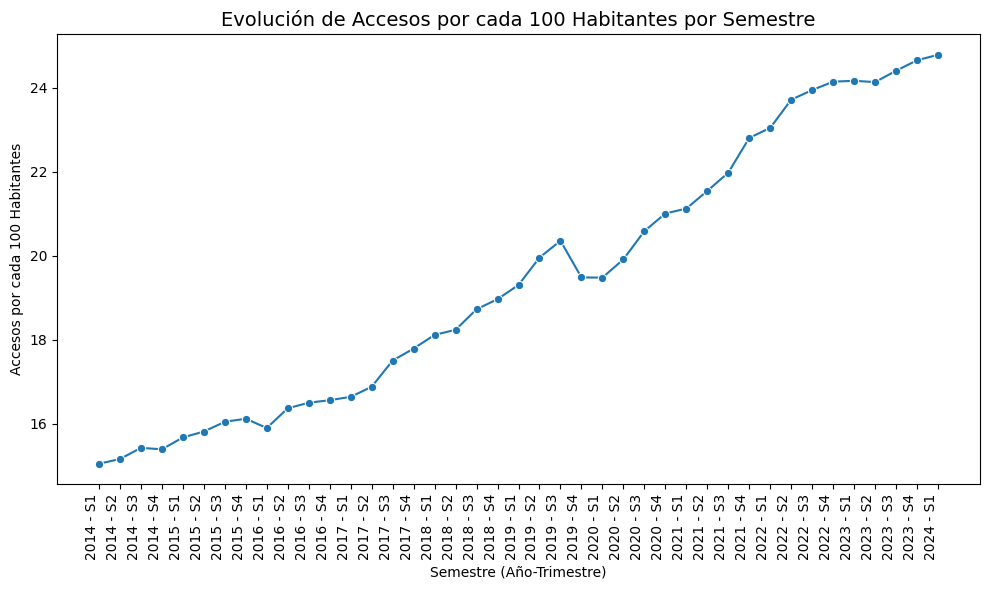
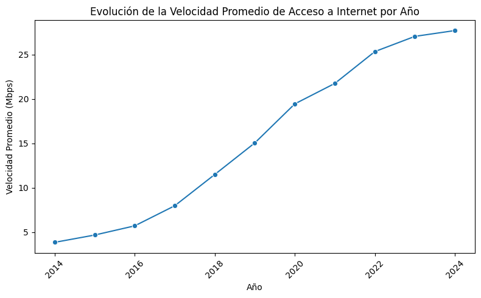

# Telecom_Analysis
Este proyecto, tiene como objetivo un análisis exhaustivo del sector de servicios de telecomunicaciones a nivel nacional. La empresa prestadora de servicios de telecomunicaciones busca comprender mejor el comportamiento de sus servicios, con especial enfoque en el acceso a Internet, para identificar oportunidades de crecimiento y mejorar la calidad de sus servicios.

### Objetivos del Proyecto
1. **Análisis Exploratorio de Datos (EDA):** 
   - Realizar un análisis exploratorio de los datos para identificar patrones, valores faltantes, outliers y registros duplicados.
   - Utilizar gráficos y análisis estadístico para extraer conclusiones sobre el comportamiento de los datos.

2. **Desarrollo de un Dashboard:**
   - Crear un dashboard interactivo y funcional que permita explorar los datos de manera detallada.
   - Incluir filtros y gráficos coherentes para facilitar la interpretación de los datos.

3. **Análisis y KPIs:**
   - Medir el KPI propuesto: Aumentar en un 2% el acceso al servicio de Internet por cada 100 hogares en cada provincia para el próximo trimestre.
   - Proponer y medir dos KPIs adicionales relevantes para el sector de telecomunicaciones.

## Estructura del Repositorio

- **`/notebooks/`**: Contiene los notebooks de análisis exploratorio de datos (EDA). Cada notebook está documentado con Markdown para explicar los pasos realizados y las conclusiones obtenidas.
- **`/data/`**: Carpeta que contiene los datos utilizados en el análisis. Incluye archivos CSV y otros formatos necesarios.
- **`/scripts/`**: Scripts utilizados para procesar y analizar los datos.
- **`/dashboard/`**: Archivos relacionados con la creación del dashboard interactivo.
- **`README.md`**: Este archivo, que proporciona una descripción general del proyecto y guía sobre cómo usar los archivos en el repositorio.

## Análisis Exploratorio de Datos (EDA)

El análisis exploratorio de datos se ha realizado en los notebooks ubicados en la carpeta `/notebooks/`. En estos notebooks, se han abordado los siguientes aspectos:
- **Valores faltantes:** Identificación y tratamiento.
- **Valores atípicos y outliers:** Detección y análisis.
- **Registros duplicados:** Identificación y eliminación.
- **Visualización de datos:** Gráficos y análisis descriptivos para entender el comportamiento de los datos.

## Dashboard

El dashboard interactivo se encuentra en la carpeta `/dashboard/`. Este dashboard permite explorar los datos con filtros y ofrece visualizaciones detalladas que facilitan la interpretación de la información. Los elementos clave del dashboard incluyen:
- **Gráficos de tendencias y distribuciones.**
- **Filtros interactivos para explorar datos por provincia y otros parámetros.**

## Análisis y KPIs

### Introducción

En el contexto de la empresa prestadora de servicios de telecomunicaciones, el objetivo es realizar un análisis completo del comportamiento del sector a nivel nacional. A continuación, se presentan dos gráficos que muestran la evolución de los accesos a internet en el país, analizados globalmente.

### Gráfica 1: Evolución de Accesos por cada 100 Habitantes

En esta gráfica se muestra la evolución de la métrica "Accesos por cada 100 Habitantes" y "Accesos por cada 100 Habitantes" por semestre. Este análisis permite observar cómo ha cambiado el acceso a internet a lo largo del tiempo, proporcionándonos una visión clara de las tendencias nacionales en términos de conectividad. 

**Propósito:**
- Identificar las tendencias generales en el acceso a internet en el país.
- Evaluar si el crecimiento es consistente o si hay períodos con caídas notables.

### Gráfica 2: Evolución de Accesos por cada 100 Hogares

Esta gráfica representa la evolución de los "Accesos por cada 100 Hogares" a lo largo del tiempo, también por semestre. Al centrarnos en los hogares, obtenemos una perspectiva sobre la penetración de internet en los hogares en comparación con la población total.

**Propósito:**
- Evaluar el acceso a internet específicamente en el contexto de los hogares, lo cual puede ofrecer una visión diferente respecto a la conectividad.
- Evaluar si el crecimiento es consistente o si hay períodos con caídas notables.

### Conclusiones

Tendencia Positiva continua: Las gráficas muestras una evolución positiva tanto en los "Accesos por cada 100 Hogares" como en "Accesos por cada 100 Habitantes", durante los últimos cuatro años, lo que indica un crecimiento sostenido en la penetración de internet a nivel nacional. Este aumento es una señal positiva de que más hogares están accediendo a servicios de internet, lo que sugiere una expansión continua en el acceso a la conectividad.
Estas gráficas proporcionan una visión integral del acceso a internet en el país, crucial para que la empresa pueda ajustar sus estrategias y mejorar su posicionamiento en el mercado.

## Análisis de la Calidad del Servicio de Internet

### Introducción

Este análisis tiene como objetivo medir y evaluar la calidad del acceso a internet a nivel nacional, desglosando los accesos por velocidad de conexión. Los datos proporcionan información sobre la distribución de accesos en diferentes rangos de velocidad, lo cual es fundamental para comprender la calidad del servicio y orientar las estrategias de la empresa.

### Gráfica: Evolución Anual de la Velocidad Promedio de Acceso

El gráfico de líneas muestra cómo ha cambiado la velocidad promedio de acceso a internet por año. Esto ayuda a identificar tendencias y patrones en la mejora del servicio a lo largo del tiempo.

**Propósito:**
- Evaluar la mejora en la calidad del servicio de internet en el país.
- Identificar años con mejoras significativas o caídas en la velocidad promedio.

### Conclusiones

- **Tendencias Generales:** La evolución anual de la velocidad promedio indica un aumento en la calidad del acceso a internet en el país, lo que sugiere una mejora continua en los servicios.

Este análisis proporciona una visión integral de la calidad del acceso a internet en el país, facilitando la identificación de oportunidades de mejora y la formulación de estrategias para optimizar el servicio ofrecido.et

## Análisis del uso de Tecnología para el Acceso al Servicio de Internet

### Justificación del Gráfico

El gráfico que se presenta a continuación muestra la evolución en el uso de diferentes tecnologías de conexión a Internet a lo largo del tiempo. Este tipo de visualización es crucial para entender las tendencias y patrones en la adopción de tecnologías, permitiendo una comparación clara entre las diferentes opciones disponibles. A través de este gráfico, podemos observar cómo cada tecnología ha evolucionado y qué tan popular se ha vuelto a lo largo de los años.

### Conclusiones

1. **ADSL (Línea de Abonado Digital Asimétrico)**
   - **Tendencia:** Disminución con el paso del tiempo.
   - **Observación:** La tecnología ADSL ha experimentado una disminución en su uso a lo largo de los años. Esto podría deberse a la llegada de tecnologías más avanzadas que ofrecen mejores velocidades y servicios.

2. **Cablemodem**
   - **Tendencia:** Mayor uso con una meseta a partir de 2022.
   - **Observación:** El cablemodem ha sido la tecnología más utilizada durante el período observado. Sin embargo, desde 2022, su tasa de adopción ha alcanzado una meseta, indicando que la saturación del mercado podría haber ocurrido, y el crecimiento de nuevos usuarios se ha estabilizado.

3. **Fibra Óptica**
   - **Tendencia:** Crecimiento constante y rápida adopción.
   - **Observación:** La fibra óptica ha mostrado una pendiente positiva significativa, convirtiéndose en la segunda tecnología más utilizada. Este crecimiento constante refleja el aumento en la demanda de conexiones de alta velocidad y la expansión de la infraestructura de fibra óptica.

4. **Wireless (Inalámbrico)**
   - **Tendencia:** Uso casi constante y bajo.
   - **Observación:** La tecnología inalámbrica ha sido la menos utilizada y su tasa de adopción se ha mantenido casi constante a lo largo del tiempo. Esto podría deberse a las limitaciones en velocidad y cobertura en comparación con otras tecnologías.

Este análisis permite a las empresas y responsables de políticas tomar decisiones informadas sobre dónde invertir en infraestructura y cómo adaptar sus estrategias para satisfacer la demanda de los usuarios en función de la evolución de estas tecnologías.

### KPI Propuesto

**Aumento del 2% en el acceso a Internet para el próximo trimestre, cada 100 hogares.**

La fórmula utilizada para calcular este KPI es:

\[ \text{KPI} = \left(\frac{\text{Nuevo acceso} - \text{Acceso actual}}{\text{Acceso actual}}\right) \times 100 \]

Donde:
- "Nuevo acceso" es el número de hogares con acceso a Internet después del próximo trimestre.
- "Acceso actual" es el número de hogares con acceso a Internet en el trimestre actual.

### KPIs Adicionales

1. **KPI 1:** [Descripción del KPI adicional 1]
2. **KPI 2:** [Descripción del KPI adicional 2]

Cada KPI adicional ha sido propuesto para proporcionar una visión más completa del desempeño de los servicios de telecomunicaciones.

## Conclusiones

Acceso a Internet por Hogares y Personas:

Distribución por Hogares: El análisis de la tabla Acceso a Internet cada 100 Hogares reveló que, aunque el acceso a internet está en crecimiento a nivel nacional, existen diferencias significativas en la penetración de internet entre provincias. Algunas provincias, especialmente las más desarrolladas, muestran un acceso superior al promedio, mientras que otras están rezagadas. Esto sugiere la necesidad de enfoques diferenciados para cerrar la brecha digital en regiones con menor acceso.
Distribución por Personas: La tabla Acceso a Internet cada 100 Personas mostró patrones similares, reflejando que, en algunas provincias, aún queda mucho por hacer para aumentar la penetración de internet en relación con la población total. Esta información es crucial para diseñar políticas públicas y estrategias de negocio enfocadas en aumentar el acceso a internet en áreas con menor cobertura.
Distribución del Acceso a Internet por Velocidad: Al analizar los porcentajes de conexiones por rango de velocidad, se observan diferencias significativas entre provincias. Las regiones más urbanizadas tienden a tener una mayor proporción de conexiones de alta velocidad, mientras que las áreas rurales dependen más de conexiones de menor velocidad. Esta información puede orientar a la empresa a mejorar la infraestructura en áreas con menor acceso a altas velocidades.

Patrones de Conectividad por Tecnología: El análisis de la tabla de Totales Accesos por Tecnología mostró un crecimiento de las tecnologías más avanzadas, como la fibra óptica, en ciertas provincias, mientras que otras regiones continúan dependiendo de tecnologías más antiguas. Este análisis es clave para dirigir las inversiones estratégicamente y priorizar la expansión de tecnologías modernas en áreas con mayor necesidad.

Detección y Tratamiento de Anomalías: Durante el proceso de limpieza de datos, se identificaron y corrigieron valores faltantes, atípicos y duplicados, lo que garantiza la calidad y precisión del análisis. Este paso es crucial para asegurar que las conclusiones sean confiables y estén basadas en datos robustos.

Visualización de Resultados: Las visualizaciones generadas proporcionan un resumen claro y efectivo del comportamiento del acceso a internet en diferentes provincias. Estas gráficas ayudarán a los stakeholders a entender rápidamente las tendencias y a tomar decisiones informadas basadas en datos sólidos.

## Cómo Ejecutar los Scripts y Notebooks

1. **Instalar dependencias:** Asegúrate de tener todas las librerías necesarias instaladas. Puedes utilizar un entorno virtual o `requirements.txt` para gestionar las dependencias.
2. **Ejecutar notebooks:** Abre los notebooks en Jupyter o cualquier otro entorno compatible para explorar el análisis en detalle.
3. **Correr scripts:** Ejecuta los scripts desde la línea de comandos o desde un entorno de desarrollo para procesar y analizar los datos.

## Licencia

Este proyecto está licenciado bajo la [Licencia MIT](LICENSE).

