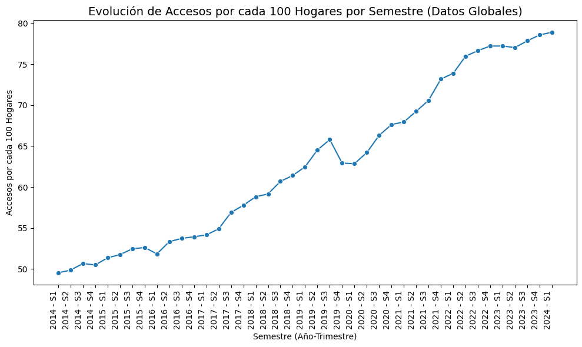

# Telecom_Analysis
Este proyecto, tiene como objetivo un análisis exhaustivo del sector de servicios de telecomunicaciones a nivel nacional. La empresa prestadora de servicios de telecomunicaciones busca comprender mejor el comportamiento de sus servicios, con especial enfoque en el acceso a Internet, para identificar oportunidades de crecimiento y mejorar la calidad de sus servicios.

### Objetivos del Proyecto
1. **Análisis Exploratorio de Datos (EDA):** 
   - Realizar un análisis exploratorio de los datos para identificar patrones, valores faltantes, outliers y registros duplicados.
   - Utilizar gráficos y análisis estadístico para extraer conclusiones sobre el comportamiento de los datos.

2. **Desarrollo de un Dashboard:**
   - Crear un dashboard interactivo y funcional que permita explorar los datos de manera detallada.
   - Incluir filtros y gráficos coherentes para facilitar la interpretación de los datos.

3. **Análisis y KPIs:**
   - Medir el KPI propuesto: Aumentar en un 2% el acceso al servicio de Internet por cada 100 hogares en cada provincia para el próximo trimestre.
   - Proponer y medir dos KPIs adicionales relevantes para el sector de telecomunicaciones.

## Estructura del Repositorio

- **`/notebooks/`**: Contiene los notebooks de análisis exploratorio de datos (EDA). Cada notebook está documentado con Markdown para explicar los pasos realizados y las conclusiones obtenidas.
- **`/data/`**: Carpeta que contiene los datos utilizados en el análisis. Incluye archivos CSV y otros formatos necesarios.
- **`/scripts/`**: Scripts utilizados para procesar y analizar los datos.
- **`/dashboard/`**: Archivos relacionados con la creación del dashboard interactivo.
- **`README.md`**: Este archivo, que proporciona una descripción general del proyecto y guía sobre cómo usar los archivos en el repositorio.

## Análisis Exploratorio de Datos (EDA)

El análisis exploratorio de datos se ha realizado en los notebooks ubicados en la carpeta `/notebooks/`. En estos notebooks, se han abordado los siguientes aspectos:
- **Valores faltantes:** Identificación y tratamiento.
- **Valores atípicos y outliers:** Detección y análisis.
- **Registros duplicados:** Identificación y eliminación.
- **Visualización de datos:** Gráficos y análisis descriptivos para entender el comportamiento de los datos.

## Dashboard

El dashboard interactivo se encuentra en la carpeta `/dashboard/`. Este dashboard permite explorar los datos con filtros y ofrece visualizaciones detalladas que facilitan la interpretación de la información. Los elementos clave del dashboard incluyen:
- **Gráficos de tendencias y distribuciones.**
- **Filtros interactivos para explorar datos por provincia y otros parámetros.**

## Análisis y KPIs

### KPI Propuesto

**Aumento del 2% en el acceso a Internet para el próximo trimestre, cada 100 hogares.**

La fórmula utilizada para calcular este KPI es:

\[ \text{KPI} = \left(\frac{\text{Nuevo acceso} - \text{Acceso actual}}{\text{Acceso actual}}\right) \times 100 \]

Donde:
- "Nuevo acceso" es el número de hogares con acceso a Internet después del próximo trimestre.
- "Acceso actual" es el número de hogares con acceso a Internet en el trimestre actual.

### KPIs Adicionales

1. **KPI 1:** [Descripción del KPI adicional 1]
2. **KPI 2:** [Descripción del KPI adicional 2]

Cada KPI adicional ha sido propuesto para proporcionar una visión más completa del desempeño de los servicios de telecomunicaciones.

## Conclusiones

En esta sección se encuentran las conclusiones derivadas del análisis exploratorio de datos, el dashboard y la evaluación de los KPIs. Aquí se destacan las oportunidades de mejora y las recomendaciones basadas en los resultados obtenidos.

## Cómo Ejecutar los Scripts y Notebooks

1. **Instalar dependencias:** Asegúrate de tener todas las librerías necesarias instaladas. Puedes utilizar un entorno virtual o `requirements.txt` para gestionar las dependencias.
2. **Ejecutar notebooks:** Abre los notebooks en Jupyter o cualquier otro entorno compatible para explorar el análisis en detalle.
3. **Correr scripts:** Ejecuta los scripts desde la línea de comandos o desde un entorno de desarrollo para procesar y analizar los datos.

## Licencia

Este proyecto está licenciado bajo la [Licencia MIT](LICENSE).

